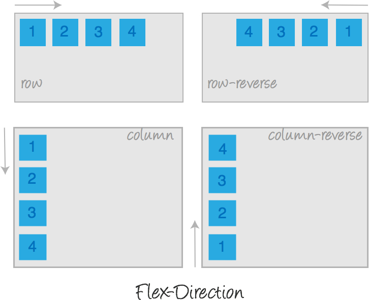
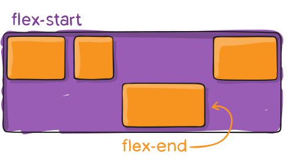

# Flexbox vertical alignment

## Flexbox

Flexbox is a one-dimensional layout method for laying out items in rows or columns. Items flex to fill additional space and shrink to fit into smaller spaces.

## Flexbox terminology

- The main axis is the axis running in the direction the flex items are being laid out in (e.g. as rows across the page, or columns down the page.) The start and end of this axis are called the main start and main end.
- The cross axis is the axis running perpendicular to the direction the flex items are being laid out in. The start and end of this axis are called the cross start and cross end.
- The parent element that has display: flex set on it is called the flex container.
- The items being laid out as flexible boxes inside the flex container are called flex items.

## Alignment

- The main axis = direction set by flex-direction = alignment via:
  - justify-content
- The cross axis = runs across the main axis = alignment via:

  - align-content
  - align-self
  - align-items

- align-items — controls alignment of all items on the cross axis.
  
- align-self — controls alignment of an individual flex item on the cross axis.
  
- align-content — controls available space between flex-lines on the cross axis. This property works only with wrapped multiple-line flex containers and it has no effect on a single-line flex container.
  
- justify-content — controls available space between flex-items on the main axis.
  

### There is no justify-self in Flexbox

On the main axis, Flexbox deals with our content as a group. The amount of space required to lay out the items is calculated, and the leftover space is then available for distribution. The justify-content property controls how that leftover space is used. Set justify-content: flex-end and the extra space is placed before the items, justify-content: space-around and it is placed on both sides of the item in that dimension, etc.

This means that a justify-self property does not make sense in Flexbox as we are always dealing with moving the entire group of items around.

On the cross axis align-self makes sense as we potentially have additional space in the flex container in that dimension, in which a single item can be moved to the start and end.

## resources

- https://developer.mozilla.org/en-US/docs/Web/CSS/CSS_Flexible_Box_Layout/Basic_Concepts_of_Flexbox
- https://developer.mozilla.org/en-US/docs/Web/CSS/CSS_Flexible_Box_Layout/Aligning_Items_in_a_Flex_Container
- https://css-tricks.com/snippets/css/a-guide-to-flexbox/
